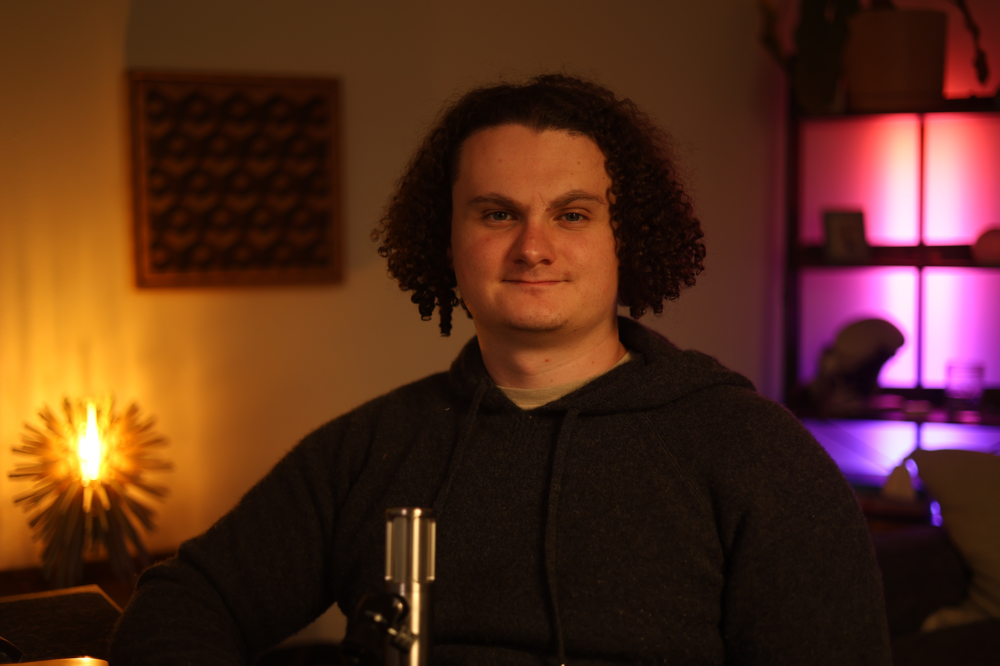

  

    <!-- Left side: Content -->
    

# About Me

- Applied AI Engineer & Consultant
- 3 Years Full-Time In Gen AI
- Based In Austin, TX

### What I'm Focused On Now
- Building <strong class="text-iron-ochre font-semibold">Bespoke Agentic Systems</strong> With Full Observability
- Applying This Tech To <strong class="text-iron-ochre font-semibold">Personal Life</strong> To Actually Reap The Benefits

    <!-- Right side: Image with name -->
    

      <h2 class="text-2xl font-semibold text-obsidian-black mb-6">Ford Lascari</h2>
      

        

          
        

      

    

  

<!--
About me slide — establishes credibility for the tax-bot case study. Emphasize the 30+ production builds and hands-on experience with Gen AI systems.
-->

