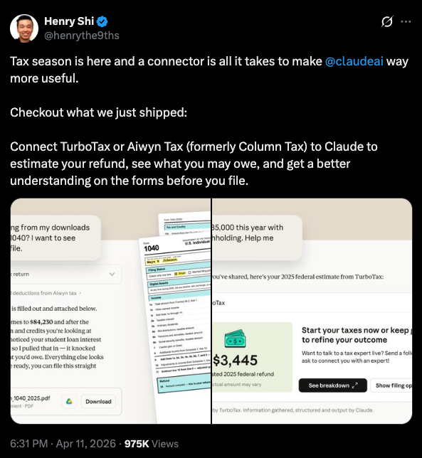

"But Doesn't Claude Already Do This?"

  

    
  

  

    
= 1 ? 'opacity-100' : 'opacity-0'" class="bg-white border-blue-600 border-1 rounded-lg p-4 transition-opacity duration-300">
      
Works When Simple, Breaks When Complex

      <ul class="text-base text-gray-900 space-y-1 list-disc list-inside">
        <li>Fine For A Basic W-2 Return</li>
        <li>Add Multiple Accounts, A Business, A Mortgage, Kids</li>
        <li>People Said It Just WASN'T WORKING</li>
      </ul>
    

    
= 2 ? 'opacity-100' : 'opacity-0'" class="bg-white border-red-600 border-2 rounded-lg p-4 transition-opacity duration-300">
      
The Real Problem

      <ul class="text-base text-gray-900 space-y-1 list-disc list-inside">
        <li>On Something This Important, You Need To Know WHY It Broke</li>
        <li>One Agent Doing Everything = NO VISIBILITY</li>
        <li>NO TRACEABILITY Means You Can't Debug It</li>
        <li>You Just Go Back To The OLD WAY</li>
      </ul>
    

  

<!--
Acknowledge the elephant: Claude shipped a TurboTax plugin. For an average user, that makes the tax angle moot. The point of this talk is NOT that you can't do taxes any other way — it's that when the stakes are real (multiple income streams, business nuance, audit exposure), you want a custom system you can inspect. Traceability is the word. A plugin doesn't hand you a paper trail. A system you design does. That's the whole reason to learn how to decompose one.

Tweet: Henry Shi (@henryfthe9ths), April 11 2026 — announcing Claude's TurboTax / Aiwyn (formerly Column Tax) connector.
-->
